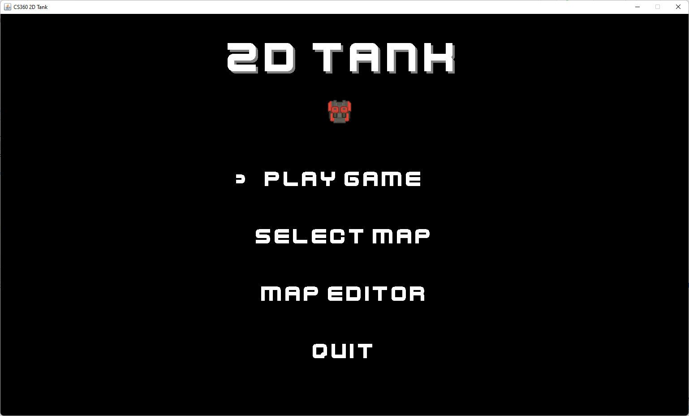
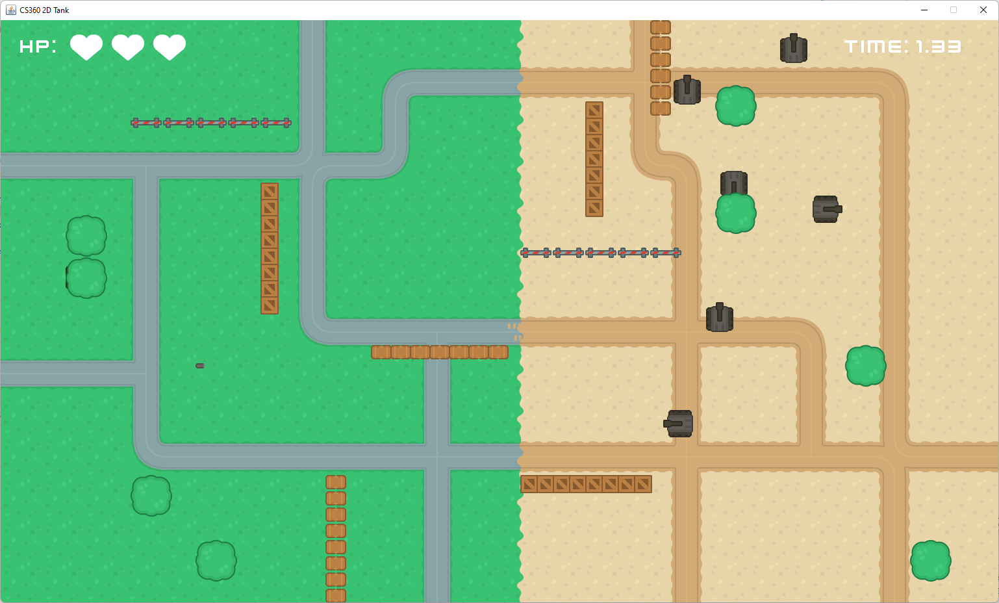

# CS360_2DTank

This project was prepared for CS360, taught by Assoc. Prof. Cao Tuan Dung.

## Introduction

Based on the concept of the classic game The Battle City. Group 2 will create a game in which tanks battle it out in top-down 2D graphics. The game is programmed in Java language, the available libraries and applied object-oriented programming thinking. The game's images and sounds were taken from opengameart.org. The program is completely designed and programmed by the group 2.

## Requirements and Installation

This program requires Java JDK and source code is simple to build and run with intelliJ (build project and run src/com/cs360/main/Main.java).

## Gameplay

The game simulates a battle of tanks. The player controls his tank with the up, down, left, right navigation keys or the W, A, S, D keys. Players move in combination with the F key to shoot enemy tanks. Every tank has a health point, the tank will be destroyed when the health point is zero. In addition to the appearance of tanks, the map also has the presence of objects such as fences, sandbags, trees, and wooden crates. Objects can have different properties such as being destroyed or passed through or shot through. The player loses when destroyed and wins when all enemies are killed.

## Contribution Summary Table

|Name |Task     |
| ------        |:-----------------------------:  |
|[Pham Tran Tri](https://github.com/tripro16102000) |Tile, TileManager  |
|[Doan Dinh Cuong](https://github.com/anonychick11111111111) |UI, Sound, KeyHandler, MouseHandler |
|[Ngo Truong Minh](https://github.com/ntm2690) |GameObj, AssetSetter, Effect, EffectManager  |
|[Dao Trung Hieu](https://github.com/hieutrungdao) |GamePanel, Programming Design |
|[Nguyen Trung Kien](https://github.com/bachdang2k) |Entity, CollisionChecker |

## References
Game assets: <https://opengameart.org/content/top-down-tanks-redux>
